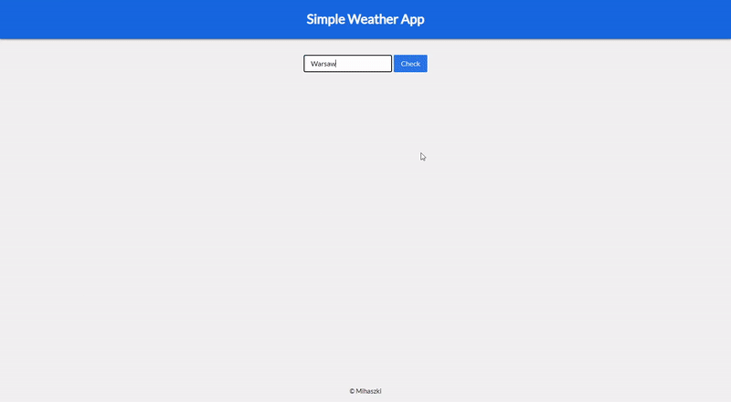

# Simple Weather App
A simple weather app made with Angular 11, Express.js and OpenWeatherMap API.

## Setup
### Runnig frontend
* Install node packages `npm install`
* Run in locally with `ng serve` or build it with `ng build`

### Runnig backend
* Install node packages with `npm install`
* Edit your API key in `weather_api_config.json` file
* Run it with: `node app.js`